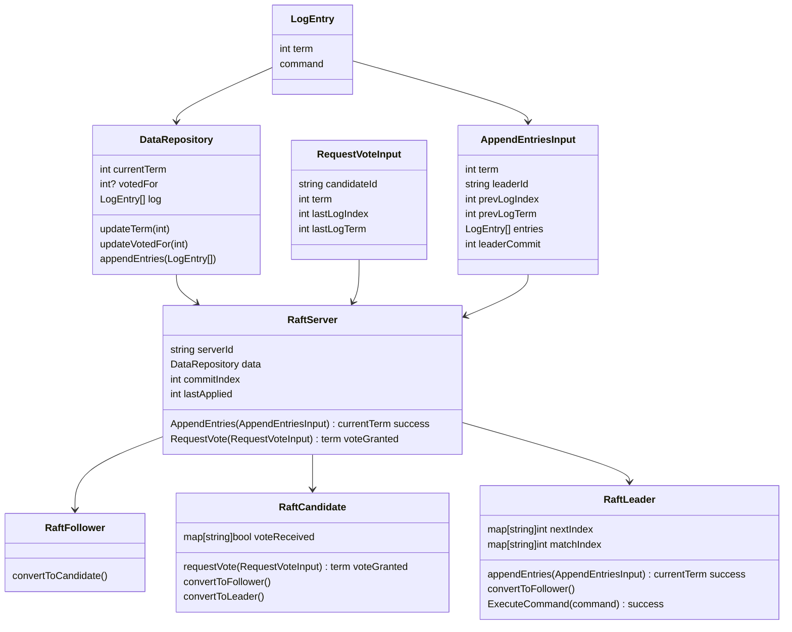
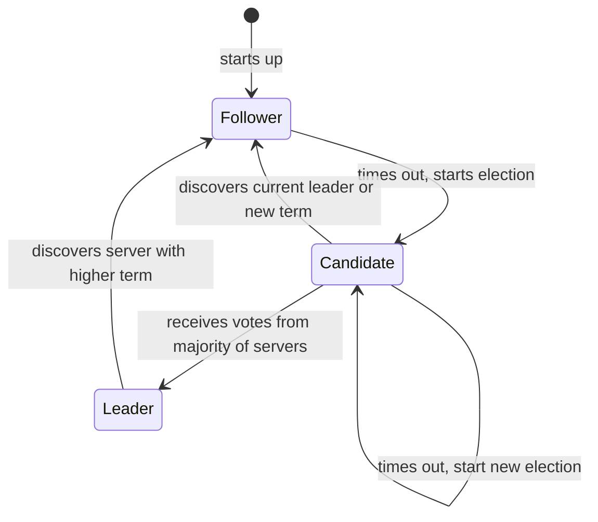

# Ropes and Logs

Building my own Raft implementation

## Essential Aspects

- Leader election
- Log replication
    - Important but non-essential: log compaction
- Safety
- Membership changes

> Raft implements consensus by first electing a distinguished leader, then 
> giving the leader complete responsibility for managing the replicated log.
> The leader accepts log entries from clients, replicates them on other
> servers, and tells servers when it is safe to apply log entries to their
> state machines.

### Notes

- "Replicated" means sent to followers; a change is "committed" by a leader
  once it knows a majority of servers have successfully applied it; a change is
  "committed" by a follower when a leader tells them it has been committed.

- broadcast time = average(network roundtrip time + write to storage time).
- election timeout should be at least 10x broadcast time (typically 10-500ms).

### Server States

